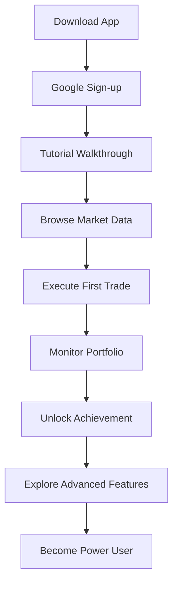
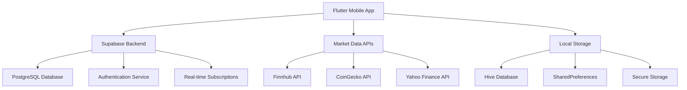
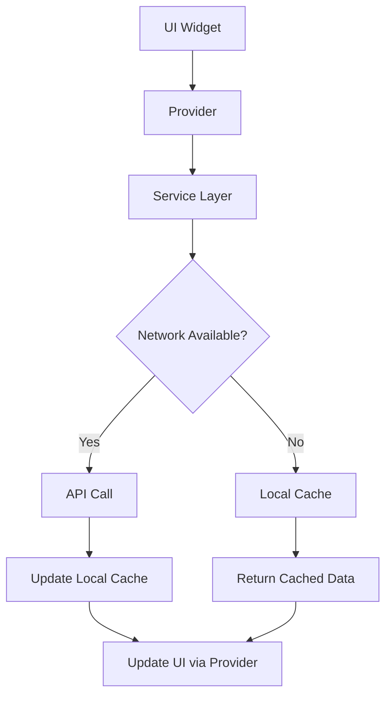
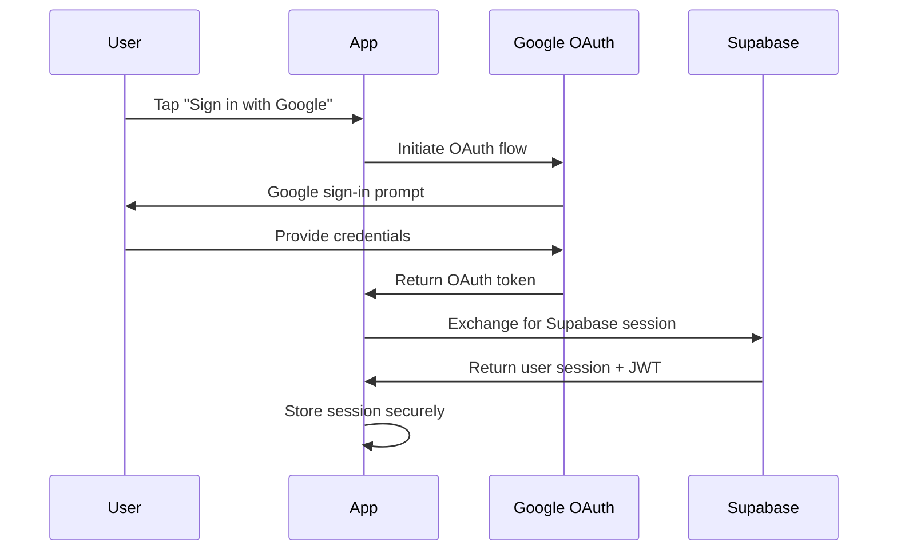

# 📈 Stox - Stock Trading Simulator

[](https://flutter.dev)
[](https://dart.dev)
[](https://supabase.io)

> **A modern, gamified stock trading simulator that provides users with a realistic trading experience using real-time market data, comprehensive portfolio management, and achievement-based gamification.**

---

## 📋 Table of Contents

1. [Product Requirements Document (PRD)](#-product-requirements-document-prd)
2. [Design Document](#-design-document)
3. [Technical Architecture](#-technical-architecture)
4. [Getting Started](#-getting-started)
5. [Development Guide](#-development-guide)
6. [Testing & Quality Assurance](#-testing--quality-assurance)
7. [Deployment](#-deployment)
8. [Contributing](#-contributing)

---

# 📊 Product Requirements Document (PRD)

## 1. Executive Summary

### 1.1 Product Vision
**Stox** empowers users to learn and practice stock trading without financial risk through realistic market simulation, comprehensive portfolio management, and gamified learning experiences.

### 1.2 Mission Statement
To democratize financial literacy and trading education by providing a risk-free, engaging platform where users can develop investing skills using real market data and professional-grade tools.

### 1.3 Success Metrics
- **User Engagement**: 70%+ Daily Active Users (DAU/MAU ratio)
- **Learning Effectiveness**: 85%+ users complete first 10 trades within 7 days
- **Retention**: 60%+ monthly retention rate
- **Educational Impact**: 90%+ users report improved trading knowledge

## 2. Market Analysis

### 2.1 Target Market
- **Primary**: Ages 18-35, financially curious individuals
- **Secondary**: College students, young professionals, trading beginners
- **Tertiary**: Experienced traders seeking practice platform

### 2.2 Market Size
- **TAM (Total Addressable Market)**: $2.1B global trading education market
- **SAM (Serviceable Addressable Market)**: $450M mobile trading simulators
- **SOM (Serviceable Obtainable Market)**: $12M realistic simulators with gamification

### 2.3 Competitive Analysis

| Competitor | Strengths | Weaknesses | Our Advantage |
|------------|-----------|------------|---------------|
| **MarketWatch Virtual Stock Exchange** | Established brand, real data | Outdated UI, no gamification | Modern UX + achievements |
| **Investopedia Simulator** | Educational content, free | Limited mobile experience | Mobile-first design |
| **Stock Trainer** | Simple interface | Fake data, limited features | Real-time data + portfolio analytics |
| **Best Brokers** | Good gamification | European focus, limited US stocks | Comprehensive US/global markets |

## 3. Product Objectives

### 3.1 Primary Objectives
1. **Educational**: Teach users stock trading fundamentals through hands-on experience
2. **Engagement**: Maintain high user engagement through gamification and real-time data
3. **Accessibility**: Provide professional trading tools in an intuitive interface
4. **Community**: Foster learning through social features and leaderboards

### 3.2 Key Results (OKRs)
- **O1**: Achieve sustainable user growth
  - KR1: 10,000+ monthly active users by Q2 2024
  - KR2: 4.5+ average app store rating
  - KR3: 25% month-over-month user growth

- **O2**: Deliver exceptional educational value
  - KR1: Users complete average of 50+ trades per month
  - KR2: 80%+ users achieve profitable portfolio within 30 days
  - KR3: 15+ minutes average session duration

- **O3**: Build robust, scalable platform
  - KR1: 99.5%+ uptime
  - KR2: <2s average API response time
  - KR3: Support 1000+ concurrent users

## 4. User Personas

### 4.1 Primary Persona: "Alex the Aspiring Trader"
- **Demographics**: 24, college graduate, $45k income
- **Goals**: Learn trading, build wealth, understand markets
- **Pain Points**: Afraid to lose real money, complex trading platforms
- **Motivations**: Financial independence, career advancement
- **Behavior**: Mobile-first, social media active, competitive

### 4.2 Secondary Persona: "Morgan the Market Curious"
- **Demographics**: 28, working professional, $65k income
- **Goals**: Diversify income, understand investments
- **Pain Points**: No trading experience, time constraints
- **Motivations**: Financial security, passive income
- **Behavior**: Research-oriented, risk-averse, goal-driven

### 4.3 Tertiary Persona: "Sam the Student"
- **Demographics**: 20, business student, part-time income
- **Goals**: Learn for career, understand economics
- **Pain Points**: Limited capital, need structured learning
- **Motivations**: Academic success, career preparation
- **Behavior**: Achievement-oriented, peer-influenced, budget-conscious

## 5. User Journey & Use Cases

### 5.1 Core User Journey


### 5.2 Key Use Cases

#### UC1: New User Onboarding
- **Actor**: First-time user
- **Goal**: Understand app and execute first trade
- **Steps**:
  1. Download and sign up with Google
  2. Complete interactive tutorial
  3. Receive $10,000 virtual cash
  4. Browse market data and search stocks
  5. Execute first buy order
  6. Unlock "First Trade" achievement

#### UC2: Daily Trading Session
- **Actor**: Regular user
- **Goal**: Monitor positions and execute trades
- **Steps**:
  1. Open app and view portfolio summary
  2. Check watchlist for price changes
  3. Analyze individual stock performance
  4. Execute buy/sell orders based on analysis
  5. Update watchlist with new interests
  6. Check achievement progress

#### UC3: Portfolio Analysis
- **Actor**: Active trader
- **Goal**: Analyze performance and optimize strategy
- **Steps**:
  1. Navigate to portfolio screen
  2. Review total P&L and percentage returns
  3. Analyze individual position performance
  4. View transaction history and patterns
  5. Access detailed holdings breakdown
  6. Compare performance metrics

## 6. Functional Requirements

### 6.1 Core Features (MVP)

#### 6.1.1 User Authentication & Profiles
- **FR1.1**: Google OAuth 2.0 integration
- **FR1.2**: User profile creation and management
- **FR1.3**: Secure session management
- **FR1.4**: Profile customization (display name, avatar)

#### 6.1.2 Market Data & Search
- **FR2.1**: Real-time stock price data from Finnhub API
- **FR2.2**: Cryptocurrency data from CoinGecko API
- **FR2.3**: ETF and index fund data
- **FR2.4**: Advanced search with autocomplete
- **FR2.5**: Asset detail screens with historical charts
- **FR2.6**: Market indices dashboard

#### 6.1.3 Trading System
- **FR3.1**: Virtual portfolio with $10,000 starting balance
- **FR3.2**: Buy/sell order execution with real-time pricing
- **FR3.3**: Position tracking and P&L calculations
- **FR3.4**: Transaction history with detailed records
- **FR3.5**: Portfolio diversification analytics
- **FR3.6**: Cash balance management

#### 6.1.4 Watchlist Management
- **FR4.1**: Personal watchlist creation
- **FR4.2**: Add/remove stocks from watchlist
- **FR4.3**: Price alerts and notifications
- **FR4.4**: Watchlist performance tracking
- **FR4.5**: Customizable watchlist categories

#### 6.1.5 Achievement System
- **FR5.1**: Progressive achievement unlocking
- **FR5.2**: Trading milestone tracking
- **FR5.3**: Portfolio performance badges
- **FR5.4**: Social sharing of achievements
- **FR5.5**: Achievement progress visualization

### 6.2 Advanced Features

#### 6.2.1 Analytics & Reporting
- **FR6.1**: Portfolio performance charts
- **FR6.2**: Risk analysis and diversification metrics
- **FR6.3**: Trading pattern analysis
- **FR6.4**: Benchmark comparison (S&P 500, NASDAQ)
- **FR6.5**: Export capabilities (PDF, CSV)

#### 6.2.2 Social Features
- **FR7.1**: Global leaderboards
- **FR7.2**: Friend connections and competitions
- **FR7.3**: Portfolio sharing
- **FR7.4**: Community discussions
- **FR7.5**: Expert insights and tips

#### 6.2.3 Educational Content
- **FR8.1**: Interactive tutorials
- **FR8.2**: Market news integration
- **FR8.3**: Trading strategy guides
- **FR8.4**: Risk management education
- **FR8.5**: Economic calendar

## 7. Non-Functional Requirements

### 7.1 Performance Requirements
- **NFR1.1**: App launch time < 3 seconds
- **NFR1.2**: API response time < 2 seconds (95th percentile)
- **NFR1.3**: Offline functionality for core features
- **NFR1.4**: Real-time data updates every 30 seconds
- **NFR1.5**: Smooth 60fps UI animations

### 7.2 Reliability Requirements
- **NFR2.1**: 99.5% uptime SLA
- **NFR2.2**: Automatic failover to cached data
- **NFR2.3**: Data persistence across app restarts
- **NFR2.4**: Graceful error handling and recovery
- **NFR2.5**: Network connectivity resilience

### 7.3 Security Requirements
- **NFR3.1**: OAuth 2.0 authentication
- **NFR3.2**: HTTPS for all API communications
- **NFR3.3**: Data encryption at rest and in transit
- **NFR3.4**: User privacy compliance (GDPR, CCPA)
- **NFR3.5**: Secure local data storage

### 7.4 Scalability Requirements
- **NFR4.1**: Support 10,000+ concurrent users
- **NFR4.2**: Horizontal scaling capability
- **NFR4.3**: Database optimization for large datasets
- **NFR4.4**: CDN integration for global performance
- **NFR4.5**: Auto-scaling infrastructure

### 7.5 Usability Requirements
- **NFR5.1**: Intuitive navigation with < 3 taps to any feature
- **NFR5.2**: Accessibility compliance (WCAG 2.1)
- **NFR5.3**: Multi-language support (English, Spanish)
- **NFR5.4**: Responsive design for all screen sizes
- **NFR5.5**: Dark/light theme support

## 8. Technical Constraints

### 8.1 Platform Constraints
- **TC1**: Flutter framework for cross-platform development
- **TC2**: iOS 12.0+ and Android API 21+ minimum versions
- **TC3**: Supabase backend infrastructure
- **TC4**: PostgreSQL database management
- **TC5**: Real-time API rate limiting compliance

### 8.2 Integration Constraints
- **TC6**: Finnhub API rate limits (60 calls/minute free tier)
- **TC7**: Google OAuth integration requirements
- **TC8**: App Store and Play Store guidelines compliance
- **TC9**: AdMob integration for monetization
- **TC10**: GDPR and data privacy regulations

## 9. Success Metrics & KPIs

### 9.1 User Acquisition Metrics
- Monthly Active Users (MAU)
- Daily Active Users (DAU)
- User acquisition cost (CAC)
- App store conversion rates
- Organic vs. paid user ratio

### 9.2 Engagement Metrics
- Session duration
- Sessions per user per day
- Feature adoption rates
- Tutorial completion rates
- Achievement unlock rates

### 9.3 Retention Metrics
- Day 1, 7, 30 retention rates
- Churn rate analysis
- Cohort retention curves
- Feature usage frequency
- Return user patterns

### 9.4 Business Metrics
- Revenue per user (ARPU)
- Lifetime value (LTV)
- Ad revenue and eCPM
- Premium feature conversion
- Cost per acquisition (CPA)

---

# 🎨 Design Document

## 1. Design Philosophy

### 1.1 Design Principles
- **Clarity First**: Information hierarchy guides users naturally
- **Professional Yet Approachable**: Serious trading tools with friendly UX
- **Data-Driven**: Real-time information presented clearly
- **Achievement-Oriented**: Gamification elements enhance engagement
- **Mobile-Optimized**: Touch-first design with finger-friendly interactions

### 1.2 Design Goals
- Create trust through professional aesthetics
- Reduce cognitive load with clean layouts
- Enhance learning through visual feedback
- Build engagement through delightful interactions
- Ensure accessibility for all users

## 2. Visual Identity

### 2.1 Brand Identity
- **Brand Name**: Stox
- **Tagline**: "Trade Smart, Learn Smarter"
- **Brand Personality**: Professional, Educational, Modern, Trustworthy
- **Voice & Tone**: Encouraging, Expert, Approachable, Clear

### 2.2 Logo System
```
 $$$$$$\ $$$$$$$$\  $$$$$$\ $$\   $$\ 
$$  __$$\\__$$  __|$$  __$$\$$ |  $$ |
$$ /  \__|  $$ |   $$ /  $$ |\$$\ $$ |
\$$$$$$\    $$ |   $$ |  $$ | \$$$$  |
 \____$$\   $$ |   $$ |  $$ | $$  $$< 
$$\   $$ |  $$ |   $$ |  $$ |$$ /\$$\ 
\$$$$$$  |  $$ |    $$$$$$  |$$ /  $$ |
 \______/   \__|    \______/ \__|  \__|
```

## 3. Color System

### 3.1 Primary Color Palette
```scss
// Primary Colors
$primary-blue: #3B82F6;      // Electric Blue - CTAs, highlights
$primary-dark: #1E40AF;      // Deep Blue - pressed states
$primary-light: #93C5FD;     // Light Blue - secondary elements

// Success/Profit Colors
$success-green: #10B981;     // Emerald Green - profits, positive changes
$success-dark: #059669;      // Dark Green - confirmation states
$success-light: #6EE7B7;     // Light Green - subtle backgrounds

// Error/Loss Colors
$error-red: #EF4444;         // Red - losses, errors
$error-dark: #DC2626;        // Dark Red - critical states
$error-light: #FCA5A5;       // Light Red - warning backgrounds

// Warning Colors
$warning-orange: #F59E0B;    // Amber - warnings, alerts
$warning-dark: #D97706;      // Dark Orange - urgent warnings
$warning-light: #FDE68A;     // Light Orange - info backgrounds
```

### 3.2 Neutral Color Palette
```scss
// Background Colors (Dark Theme)
$bg-primary: #0B1220;        // Deep Navy - primary background
$bg-secondary: #151E2E;      // Dark Blue - cards, surfaces
$bg-tertiary: #1F2937;       // Medium Blue - elevated surfaces
$bg-quaternary: #374151;     // Light Blue - input fields

// Text Colors
$text-primary: #FFFFFF;      // White - primary text
$text-secondary: #D1D5DB;    // Light Gray - secondary text
$text-tertiary: #9CA3AF;     // Medium Gray - tertiary text
$text-quaternary: #6B7280;   // Dark Gray - disabled text
```

### 3.3 Accent Colors
```scss
// Accent Colors for Visual Interest
$accent-pink: #EC4899;       // Pink - special highlights
$accent-purple: #8B5CF6;     // Purple - premium features
$accent-cyan: #06B6D4;       // Cyan - information
$accent-yellow: #EAB308;     // Yellow - notifications
```

## 4. Typography System

### 4.1 Font Family
- **Primary**: Nunito (Google Fonts)
- **Fallback**: -apple-system, BlinkMacSystemFont, 'Segoe UI', Roboto, sans-serif
- **Monospace**: 'SF Mono', 'Monaco', 'Consolas', monospace (for numbers/data)

### 4.2 Type Scale
```scss
// Heading Styles
$font-h1: 32px;  // weight: 900, line-height: 1.2
$font-h2: 28px;  // weight: 800, line-height: 1.25
$font-h3: 24px;  // weight: 700, line-height: 1.3
$font-h4: 20px;  // weight: 700, line-height: 1.35
$font-h5: 18px;  // weight: 600, line-height: 1.4
$font-h6: 16px;  // weight: 600, line-height: 1.45

// Body Styles
$font-body-lg: 18px;   // weight: 400, line-height: 1.6
$font-body: 16px;      // weight: 400, line-height: 1.5
$font-body-sm: 14px;   // weight: 400, line-height: 1.45
$font-caption: 12px;   // weight: 500, line-height: 1.4
$font-overline: 10px;  // weight: 700, line-height: 1.3, uppercase
```

### 4.3 Font Usage Guidelines
- **Headlines**: Bold weights (700-900) for emphasis and hierarchy
- **Body Text**: Regular weight (400) for readability
- **UI Elements**: Medium weight (500-600) for buttons and labels
- **Data/Numbers**: Monospace font for financial figures
- **Captions**: Medium weight (500) for small, secondary information

## 5. Layout System

### 5.1 Grid System
- **Base Unit**: 8px grid system
- **Margins**: 16px on mobile, 24px on tablet
- **Gutters**: 16px between columns
- **Breakpoints**: 
  - Mobile: 320px - 767px
  - Tablet: 768px - 1023px
  - Desktop: 1024px+

### 5.2 Spacing Scale
```scss
$space-1: 4px;    // Tiny spacing
$space-2: 8px;    // Small spacing
$space-3: 12px;   // Medium-small spacing
$space-4: 16px;   // Medium spacing (base)
$space-5: 20px;   // Medium-large spacing
$space-6: 24px;   // Large spacing
$space-8: 32px;   // X-large spacing
$space-10: 40px;  // XX-large spacing
$space-12: 48px;  // XXX-large spacing
```

### 5.3 Component Spacing
- **Between sections**: 24px - 32px
- **Between cards**: 16px
- **Card padding**: 16px - 20px
- **Button padding**: 12px vertical, 16px horizontal
- **Input padding**: 12px vertical, 16px horizontal

## 6. Component Design System

### 6.1 Buttons
```scss
// Primary Button
.btn-primary {
  background: $primary-blue;
  color: white;
  padding: 12px 16px;
  border-radius: 12px;
  font-weight: 600;
  box-shadow: 0 2px 4px rgba(59, 130, 246, 0.25);
}

// Secondary Button
.btn-secondary {
  background: transparent;
  color: $primary-blue;
  border: 1px solid $primary-blue;
  padding: 12px 16px;
  border-radius: 12px;
  font-weight: 600;
}

// Success Button (Buy)
.btn-success {
  background: $success-green;
  color: white;
  padding: 12px 16px;
  border-radius: 12px;
  font-weight: 600;
}

// Error Button (Sell)
.btn-error {
  background: $error-red;
  color: white;
  padding: 12px 16px;
  border-radius: 12px;
  font-weight: 600;
}
```

### 6.2 Cards
```scss
.card {
  background: $bg-secondary;
  border-radius: 16px;
  padding: 16px;
  box-shadow: 0 4px 12px rgba(0, 0, 0, 0.24);
  border: 1px solid rgba(255, 255, 255, 0.1);
}

.card-elevated {
  @extend .card;
  box-shadow: 0 8px 24px rgba(0, 0, 0, 0.32);
  transform: translateY(-2px);
}
```

### 6.3 Input Fields
```scss
.input-field {
  background: $bg-tertiary;
  border: 1px solid rgba(255, 255, 255, 0.2);
  border-radius: 12px;
  padding: 12px 16px;
  color: $text-primary;
  font-size: 16px;
  
  &:focus {
    border-color: $primary-blue;
    box-shadow: 0 0 0 3px rgba(59, 130, 246, 0.1);
  }
}
```

### 6.4 Navigation
```scss
.bottom-nav {
  background: $bg-secondary;
  border-top: 1px solid rgba(255, 255, 255, 0.1);
  height: 80px;
  
  .nav-item {
    color: $text-tertiary;
    font-size: 12px;
    font-weight: 600;
    
    &.active {
      color: $primary-blue;
    }
  }
}
```

## 7. Icon System

### 7.1 Icon Style
- **Style**: Outlined icons for consistency
- **Weight**: 2px stroke width
- **Size**: 16px, 20px, 24px variants
- **Library**: Material Design Icons + custom finance icons

### 7.2 Key Icons
```
📈 trending_up - Market gains, portfolio growth
📉 trending_down - Market losses, declines  
💰 account_balance_wallet - Portfolio, wallet
🏆 emoji_events - Achievements, awards
⭐ star - Watchlist, favorites
📊 bar_chart - Analytics, reports
🔍 search - Search functionality
➕ add - Add to watchlist, buy orders
➖ remove - Remove from watchlist, sell orders
🔄 refresh - Data refresh, sync
⚙️ settings - User settings, preferences
👤 person - User profile, account
```

## 8. Animation & Motion

### 8.1 Motion Principles
- **Functional**: Animations serve purpose, guide attention
- **Natural**: Easing curves mimic real-world physics
- **Efficient**: Quick transitions, no unnecessary delays
- **Respectful**: Honor user's reduced motion preferences

### 8.2 Timing & Easing
```scss
// Duration
$duration-fast: 150ms;     // Micro-interactions
$duration-normal: 250ms;   // Standard transitions
$duration-slow: 400ms;     // Complex animations

// Easing Functions
$ease-out: cubic-bezier(0.215, 0.610, 0.355, 1.000);
$ease-in-out: cubic-bezier(0.645, 0.045, 0.355, 1.000);
$ease-spring: cubic-bezier(0.175, 0.885, 0.32, 1.275);
```

### 8.3 Animation Types
- **Page Transitions**: Slide transitions between screens
- **Loading States**: Shimmer effects for content loading
- **Success States**: Celebration animations for achievements
- **Data Updates**: Smooth number counting, chart animations
- **Micro-interactions**: Button press feedback, icon changes

## 9. Responsive Design

### 9.1 Mobile-First Approach
- Design starts with mobile constraints
- Progressive enhancement for larger screens
- Touch-optimized interactions (44px minimum touch targets)
- Thumb-friendly navigation placement

### 9.2 Screen Adaptations
```scss
// Mobile (320px - 767px)
- Single column layout
- Bottom navigation
- Full-width cards
- Stack elements vertically

// Tablet (768px - 1023px) 
- Two-column layout where appropriate
- Side navigation option
- Larger cards with more content
- Grid layouts for lists

// Desktop (1024px+)
- Multi-column layouts
- Sidebar navigation
- Hover states for interactive elements
- Keyboard navigation support
```

## 10. Accessibility Guidelines

### 10.1 Color Accessibility
- Minimum contrast ratio of 4.5:1 for normal text
- Minimum contrast ratio of 3:1 for large text
- Color not used as the only means of conveying information
- Focus indicators visible for keyboard navigation

### 10.2 Interactive Elements
- Minimum 44px touch targets on mobile
- Clear focus indicators for keyboard navigation
- Screen reader compatible labels and descriptions
- Semantic HTML structure for assistive technologies

### 10.3 Typography Accessibility
- Scalable text up to 200% without horizontal scrolling
- Line height of at least 1.5 times the font size
- Sufficient spacing between paragraphs and sections
- High contrast text on background colors

---

# 🏗️ Technical Architecture

## 1. System Architecture Overview

### 1.1 High-Level Architecture


### 1.2 Technology Stack
- **Frontend**: Flutter 3.0+, Dart 3.0+
- **Backend**: Supabase (PostgreSQL, Auth, Real-time)
- **State Management**: Provider pattern with ChangeNotifier
- **Local Storage**: Hive (primary), SharedPreferences (cache)
- **APIs**: Finnhub, CoinGecko, Yahoo Finance
- **Authentication**: Google OAuth 2.0 via Supabase
- **Monetization**: Google AdMob
- **Analytics**: Firebase Analytics (optional)

## 2. Database Schema

### 2.1 Core Tables
```sql
-- Users table (extends auth.users)
CREATE TABLE users (
  id UUID PRIMARY KEY DEFAULT auth.uid(),
  email TEXT NOT NULL UNIQUE,
  username TEXT UNIQUE,
  display_name TEXT,
  avatar_url TEXT,
  color_theme TEXT DEFAULT 'neon_navy',
  cash_balance NUMERIC DEFAULT 10000.00 CHECK (cash_balance >= 0),
  initial_balance NUMERIC DEFAULT 10000.00,
  total_deposited NUMERIC DEFAULT 10000.00,
  total_trades INTEGER DEFAULT 0,
  total_profit_loss NUMERIC DEFAULT 0.00,
  created_at TIMESTAMP WITH TIME ZONE DEFAULT NOW(),
  updated_at TIMESTAMP WITH TIME ZONE DEFAULT NOW()
);

-- Portfolio holdings table
CREATE TABLE portfolio (
  id UUID PRIMARY KEY DEFAULT gen_random_uuid(),
  user_id UUID REFERENCES users(id) ON DELETE CASCADE,
  symbol TEXT NOT NULL,
  quantity INTEGER NOT NULL CHECK (quantity > 0),
  avg_price NUMERIC NOT NULL CHECK (avg_price > 0),
  created_at TIMESTAMP WITH TIME ZONE DEFAULT NOW(),
  updated_at TIMESTAMP WITH TIME ZONE DEFAULT NOW(),
  UNIQUE(user_id, symbol)
);

-- Transaction history table
CREATE TABLE transactions (
  id UUID PRIMARY KEY DEFAULT gen_random_uuid(),
  user_id UUID REFERENCES users(id) ON DELETE CASCADE,
  symbol TEXT NOT NULL,
  type TEXT NOT NULL CHECK (type IN ('buy', 'sell')),
  quantity INTEGER NOT NULL CHECK (quantity > 0),
  price NUMERIC NOT NULL CHECK (price > 0),
  total_value NUMERIC NOT NULL CHECK (total_value > 0),
  timestamp TIMESTAMP WITH TIME ZONE DEFAULT NOW()
);

-- User watchlist table
CREATE TABLE watchlist (
  id UUID PRIMARY KEY DEFAULT gen_random_uuid(),
  user_id UUID REFERENCES users(id) ON DELETE CASCADE,
  symbol TEXT NOT NULL,
  added_at TIMESTAMP WITH TIME ZONE DEFAULT NOW(),
  UNIQUE(user_id, symbol)
);

-- User achievements table
CREATE TABLE user_achievements (
  id UUID PRIMARY KEY DEFAULT gen_random_uuid(),
  user_id UUID REFERENCES users(id) ON DELETE CASCADE,
  achievement_id TEXT NOT NULL,
  progress INTEGER DEFAULT 0,
  target INTEGER DEFAULT 1,
  progress_data JSONB DEFAULT '{}',
  unlocked_at TIMESTAMP WITH TIME ZONE,
  created_at TIMESTAMP WITH TIME ZONE DEFAULT NOW(),
  updated_at TIMESTAMP WITH TIME ZONE DEFAULT NOW(),
  UNIQUE(user_id, achievement_id)
);

-- User settings table
CREATE TABLE user_settings (
  id UUID PRIMARY KEY DEFAULT gen_random_uuid(),
  user_id UUID REFERENCES users(id) ON DELETE CASCADE,
  setting_key TEXT NOT NULL,
  setting_value JSONB NOT NULL,
  created_at TIMESTAMP WITH TIME ZONE DEFAULT NOW(),
  updated_at TIMESTAMP WITH TIME ZONE DEFAULT NOW(),
  UNIQUE(user_id, setting_key)
);
```

### 2.2 Performance Indexes
```sql
-- Portfolio indexes
CREATE INDEX idx_portfolio_user_id ON portfolio(user_id);
CREATE INDEX idx_portfolio_symbol ON portfolio(symbol);

-- Transaction indexes
CREATE INDEX idx_transactions_user_id ON transactions(user_id);
CREATE INDEX idx_transactions_timestamp ON transactions(timestamp);

-- Watchlist indexes
CREATE INDEX idx_watchlist_user_id ON watchlist(user_id);

-- Achievement indexes
CREATE INDEX idx_user_achievements_user_id ON user_achievements(user_id);
```

## 3. API Integration

### 3.1 Market Data Services
```dart
// Enhanced Market Data Service Architecture
class EnhancedMarketDataService {
  // Primary: Finnhub API (stocks)
  static Future<MarketAssetModel?> fetchFromFinnhub(String symbol);
  
  // Secondary: Yahoo Finance API (backup)
  static Future<MarketAssetModel?> fetchFromYahoo(String symbol);
  
  // Tertiary: Alpha Vantage (premium data)
  static Future<MarketAssetModel?> fetchFromAlphaVantage(String symbol);
  
  // Crypto: CoinGecko API
  static Future<List<MarketAssetModel>> fetchCryptoData();
  
  // Caching strategy with fallbacks
  static Future<MarketAssetModel?> getAsset(String symbol) async {
    // 1. Check local cache first
    // 2. Try Finnhub API
    // 3. Fallback to Yahoo Finance
    // 4. Cache result for future use
  }
}
```

### 3.2 Rate Limiting Strategy
```dart
class APIRateLimit {
  static const Map<String, int> rateLimits = {
    'finnhub': 60,      // 60 calls/minute
    'coingecko': 50,    // 50 calls/minute
    'yahoo': 100,       // 100 calls/minute
  };
  
  static Future<void> respectRateLimit(String api, String symbol);
  static bool isRateLimited(String api);
}
```

## 4. State Management Architecture

### 4.1 Provider Pattern Implementation
```dart
// Main providers structure
MultiProvider(
  providers: [
    ChangeNotifierProvider(create: (_) => AuthProvider()),
    ChangeNotifierProvider(create: (_) => MarketDataProvider()),
    ChangeNotifierProvider(create: (_) => PortfolioProvider()),
    ChangeNotifierProvider(create: (_) => WatchlistProvider()),
    ChangeNotifierProvider(create: (_) => AchievementProvider()),
    ChangeNotifierProvider(create: (_) => ThemeProvider()),
  ],
  child: StoxApp(),
);
```

### 4.2 Data Flow Architecture


## 5. Caching Strategy

### 5.1 Multi-Tier Caching
```dart
// 3-tier caching system
class CacheManager {
  // Tier 1: Memory cache (fastest, 200 items max)
  static final Map<String, CacheEntry> memoryCache = {};
  
  // Tier 2: Local storage (SharedPreferences)
  static Future<T?> getFromDisk<T>(String key);
  
  // Tier 3: Local database (Hive)
  static Future<T?> getFromDatabase<T>(String key);
  
  // Cache invalidation strategy
  static const Map<String, Duration> cacheTTL = {
    'market_data': Duration(minutes: 2),
    'user_portfolio': Duration(minutes: 5),
    'user_settings': Duration(minutes: 30),
    'static_data': Duration(hours: 24),
  };
}
```

### 5.2 Offline-First Architecture
- All critical data cached locally
- Optimistic updates with sync reconciliation
- Conflict resolution for concurrent modifications
- Background sync when connectivity restored

## 6. Security Implementation

### 6.1 Authentication Flow


### 6.2 Data Security Measures
- **Encryption**: AES-256 for sensitive local data
- **Network**: TLS 1.3 for all API communications
- **Authentication**: JWT tokens with refresh rotation
- **Storage**: Flutter Secure Storage for credentials
- **Validation**: Input sanitization and validation

## 7. Performance Optimization

### 7.1 App Performance Targets
```yaml
Performance Metrics:
  app_launch_time: < 3s (cold start)
  api_response_time: < 2s (95th percentile)  
  ui_frame_rate: 60fps (smooth animations)
  memory_usage: < 150MB (typical session)
  battery_impact: Minimal (optimized for mobile)
```

### 7.2 Optimization Strategies
- **Lazy Loading**: Load screens and data on-demand
- **Image Optimization**: Cached, compressed, progressive loading
- **Database Optimization**: Indexed queries, connection pooling
- **Network Optimization**: Request batching, compression
- **UI Optimization**: Widget recycling, efficient rebuilds

## 8. Testing Strategy

### 8.1 Test Coverage Goals
- **Unit Tests**: >80% code coverage
- **Widget Tests**: All critical UI components
- **Integration Tests**: Complete user workflows
- **Performance Tests**: Load testing, stress testing
- **Security Tests**: Authentication, data protection

### 8.2 Automated Testing Pipeline
```yaml
Test Pipeline:
  - Unit Tests (Dart)
  - Widget Tests (Flutter)  
  - Integration Tests (Flutter Driver)
  - Performance Tests (Custom scripts)
  - Security Tests (Static analysis)
  - UI Tests (Screenshots, golden tests)
```

---

# 🚀 Getting Started

## Prerequisites

- **Flutter SDK**: 3.0 or higher
- **Dart SDK**: 3.0 or higher  
- **Development Environment**: Android Studio, VS Code, or IntelliJ
- **Mobile Development**: Xcode (iOS) or Android SDK
- **API Keys**: Finnhub, CoinGecko, Google OAuth credentials

## Installation

### 1. Clone the Repository
```bash
git clone https://github.com/yourusername/stox-app.git
cd stox-app/stox
```

### 2. Install Dependencies
```bash
flutter pub get
```

### 3. Configure Environment
```bash
# Copy environment template
cp lib/config/env.example.dart lib/config/env.dart

# Edit with your API keys
nano lib/config/env.dart
```

### 4. Set up Supabase Backend
```bash
# Install Supabase CLI
npm install -g @supabase/cli

# Initialize Supabase project
supabase init

# Run database migrations
supabase db reset
```

### 5. Run the Application
```bash
# Development mode
flutter run

# Release mode
flutter run --release

# Specific platform
flutter run -d ios
flutter run -d android
```

## Development Commands

```bash
# Essential commands
flutter pub get          # Install dependencies
flutter clean            # Clean build artifacts
flutter analyze          # Static analysis and linting
flutter test             # Run unit tests
flutter build apk        # Build Android APK
flutter build ipa        # Build iOS IPA

# Testing
flutter test test_scripts/mvp_feature_tests.dart
flutter test test_scripts/stress_tests.dart  
dart test_scripts/test_runner.dart all

# Performance monitoring
dart test_scripts/performance_monitor.dart
```

---

# 👨‍💻 Development Guide

## Project Structure

```
lib/
├── config/              # API keys and configuration
│   ├── api_keys.dart
│   ├── supabase_config.dart
│   └── env.dart
├── models/              # Data models and entities
│   ├── user_model.dart
│   ├── portfolio_model.dart
│   ├── transaction_model.dart
│   └── market_asset_model.dart
├── providers/           # State management (Provider pattern)
│   ├── auth_provider.dart
│   ├── portfolio_provider.dart
│   ├── market_data_provider.dart
│   └── achievement_provider.dart
├── screens/             # UI screens and pages
│   ├── auth/
│   ├── portfolio/
│   ├── market/
│   └── achievements/
├── services/            # Business logic and API calls
│   ├── auth_service.dart
│   ├── market_data_service.dart
│   ├── portfolio_service.dart
│   └── local_database_service.dart
├── widgets/             # Reusable UI components
│   ├── portfolio_summary_card.dart
│   ├── market_asset_tile.dart
│   └── achievement_badge.dart
└── utils/               # Helper functions and utilities
    ├── number_formatter.dart
    ├── date_formatter.dart
    └── validators.dart
```

## Coding Standards

### 1. Dart Style Guide
```dart
// ✅ Good: Clear naming and documentation
/// Calculates the profit/loss for a portfolio position
class PortfolioCalculator {
  static double calculatePnL({
    required double currentPrice,
    required double avgPrice, 
    required int quantity,
  }) {
    return (currentPrice - avgPrice) * quantity;
  }
}

// ❌ Bad: Unclear naming, no documentation
class PC {
  static double calc(double c, double a, int q) {
    return (c - a) * q;
  }
}
```

### 2. State Management Patterns
```dart
// ✅ Good: Proper Provider usage
class PortfolioProvider with ChangeNotifier {
  List<PortfolioModel> _portfolio = [];
  bool _isLoading = false;
  
  List<PortfolioModel> get portfolio => _portfolio;
  bool get isLoading => _isLoading;
  
  Future<void> loadPortfolio(String userId) async {
    _isLoading = true;
    notifyListeners();
    
    try {
      _portfolio = await PortfolioService.getPortfolio(userId);
    } finally {
      _isLoading = false;
      notifyListeners();
    }
  }
}
```

### 3. Error Handling
```dart
// ✅ Good: Comprehensive error handling
Future<MarketAssetModel?> fetchAssetData(String symbol) async {
  try {
    final response = await http.get(Uri.parse('$baseUrl/$symbol'));
    
    if (response.statusCode == 200) {
      return MarketAssetModel.fromJson(json.decode(response.body));
    } else if (response.statusCode == 429) {
      // Handle rate limiting
      await Future.delayed(Duration(seconds: 60));
      return fetchAssetData(symbol); // Retry
    } else {
      throw HttpException('HTTP ${response.statusCode}: ${response.body}');
    }
  } on SocketException {
    // Network error - use cached data
    return LocalDatabaseService.getCachedAsset(symbol);
  } catch (e) {
    print('Error fetching $symbol: $e');
    return null;
  }
}
```

## Feature Development Workflow

### 1. Planning Phase
- Create GitHub issue with detailed requirements
- Design UI mockups and user flow
- Plan database schema changes if needed
- Identify API requirements and rate limits

### 2. Implementation Phase
```bash
# Create feature branch
git checkout -b feature/new-feature-name

# Implement feature with tests
flutter test test/features/new_feature_test.dart

# Run comprehensive test suite
dart test_scripts/test_runner.dart all
```

### 3. Code Review Checklist
- [ ] Code follows style guidelines
- [ ] All tests pass (unit, widget, integration)
- [ ] Performance impact assessed
- [ ] Error handling implemented
- [ ] Documentation updated
- [ ] Accessibility considerations addressed

### 4. Deployment Process
```bash
# Build and test
flutter clean && flutter pub get
flutter analyze
flutter test
dart test_scripts/test_runner.dart all

# Build release artifacts
flutter build apk --release
flutter build ipa --release

# Deploy to app stores
# (Follow platform-specific deployment guides)
```

---

# 🧪 Testing & Quality Assurance

## Testing Strategy Overview

Our comprehensive testing framework ensures MVP features remain stable with every code change:

### Test Suite Architecture
```
🧪 Test Suites
├── 🚀 MVP Feature Tests (Critical Path)
│   ├── Authentication & User Management
│   ├── Market Data & Search  
│   ├── Portfolio Management & Trading
│   ├── Achievement System
│   ├── Offline Functionality
│   └── Error Handling & Recovery
├── 🔥 Stress Tests (Performance & Scale)
│   ├── 1000+ concurrent cache operations
│   ├── 500+ high-volume transactions
│   ├── 10 concurrent user simulations
│   ├── Memory leak detection
│   └── Network failure recovery
└── 🔄 Integration Tests (End-to-End)
    ├── Complete user journeys
    ├── Cross-screen data consistency  
    ├── Real-time updates
    └── Offline/online transitions
```

## Running Tests

### Individual Test Suites
```bash
# Critical MVP functionality
flutter test test_scripts/mvp_feature_tests.dart

# Performance & scalability  
flutter test test_scripts/stress_tests.dart

# End-to-end workflows
flutter test test_scripts/integration_tests.dart
```

### Automated Test Runner
```bash
# Run all tests with detailed reporting
dart test_scripts/test_runner.dart all

# Run specific test type  
dart test_scripts/test_runner.dart mvp
dart test_scripts/test_runner.dart stress
dart test_scripts/test_runner.dart integration
```

### Performance Monitoring
```bash
# Generate performance benchmarks
dart test_scripts/performance_monitor.dart
```

## Quality Standards

### Performance Targets
| Component | Target | Excellent | Good | Needs Attention |
|-----------|--------|-----------|------|-----------------|
| **Cache Ops** | <1ms | <1ms | <5ms | >15ms |
| **DB Queries** | <5ms | <5ms | <15ms | >50ms |
| **Network** | <200ms | <100ms | <200ms | >500ms |
| **Throughput** | >500 ops/sec | >1000 | >500 | <200 |

### Success Metrics
- ✅ All MVP tests passing
- ✅ No performance regressions >2%
- ✅ 100% offline functionality  
- ✅ Graceful error recovery
- ✅ Memory stability during extended use

---

# 🚢 Deployment

## Build Configuration

### Android Release Build
```bash
# Generate signed APK
flutter build apk --release

# Generate App Bundle (recommended for Play Store)
flutter build appbundle --release

# Build configuration in android/app/build.gradle
android {
    signingConfigs {
        release {
            keyAlias keystoreProperties['keyAlias']
            keyPassword keystoreProperties['keyPassword'] 
            storeFile file(keystoreProperties['storeFile'])
            storePassword keystoreProperties['storePassword']
        }
    }
}
```

### iOS Release Build  
```bash
# Build iOS Archive
flutter build ipa --release

# Xcode configuration for App Store
# - Update version and build numbers
# - Configure signing certificates
# - Set deployment target iOS 12.0+
# - Enable required capabilities
```

## Environment Configuration

### Production Environment Variables
```dart
// lib/config/env.dart
class Environment {
  static const String supabaseUrl = 'https://your-project.supabase.co';
  static const String supabaseAnonKey = 'your-anon-key';
  static const String finnhubApiKey = 'your-finnhub-key';
  static const String coinGeckoApiKey = 'your-coingecko-key';
  static const String admobAppId = 'ca-app-pub-xxx';
}
```

### Database Migrations
```sql
-- Run in Supabase SQL editor before deployment
-- Check schema_cleanup.sql for latest migrations
```

## App Store Deployment

### Google Play Store
```yaml
Release Checklist:
  - App signed with upload key
  - Target API level 33+ (Android 13)
  - App Bundle format preferred
  - Privacy policy URL configured
  - App content rating completed
  - Screenshots and descriptions updated
```

### Apple App Store
```yaml  
Release Checklist:
  - Xcode archive with distribution certificate
  - iOS 12.0+ deployment target
  - App Store Connect metadata complete
  - Privacy nutrition labels configured  
  - Screenshots for all device sizes
  - TestFlight beta testing completed
```

## Monitoring & Analytics

### Performance Monitoring
- App launch time tracking
- API response time monitoring  
- Crash reporting and analysis
- User engagement metrics
- Revenue and conversion tracking

### Key Metrics Dashboard
```yaml
Critical Metrics:
  - Daily/Monthly Active Users
  - Session duration and frequency
  - Feature adoption rates
  - Achievement unlock rates  
  - Portfolio value growth
  - Error rates and crash frequency
```

---

# 🤝 Contributing

## Contributing Guidelines

We welcome contributions! Please follow these guidelines:

### 1. Code of Conduct
- Be respectful and inclusive
- Focus on constructive feedback
- Help create a welcoming environment for all contributors

### 2. Development Process
```bash
# Fork the repository
git fork https://github.com/yourusername/stox-app.git

# Create feature branch
git checkout -b feature/amazing-feature

# Make changes and test
flutter test
dart test_scripts/test_runner.dart all

# Commit with descriptive message
git commit -m "feat: Add amazing new trading feature"

# Push and create pull request
git push origin feature/amazing-feature
```

### 3. Pull Request Process
- Ensure all tests pass
- Update documentation as needed
- Add screenshots for UI changes
- Link related issues
- Request review from maintainers

### 4. Issue Reporting
When reporting issues, please include:
- Device and OS version
- App version
- Steps to reproduce
- Expected vs actual behavior
- Screenshots or error logs

## Development Setup for Contributors

### Prerequisites
- Flutter SDK 3.0+
- Git version control
- Code editor (VS Code, Android Studio)
- API keys for testing (see setup guide)

### Getting Started
```bash
# Clone your fork
git clone https://github.com/your-username/stox-app.git
cd stox-app/stox

# Set up upstream remote
git remote add upstream https://github.com/original-owner/stox-app.git

# Install dependencies
flutter pub get

# Run tests to ensure setup works
flutter test
```

### Contribution Areas
- 🐛 **Bug Fixes**: Fix reported issues
- ✨ **Features**: Implement new functionality  
- 📚 **Documentation**: Improve docs and guides
- 🧪 **Testing**: Add test coverage
- 🎨 **UI/UX**: Design improvements
- 🔧 **Performance**: Optimization work

---

## 📄 License

This project is licensed under the MIT License - see the [LICENSE](LICENSE) file for details.

## 📞 Support & Contact

- **GitHub Issues**: [Report bugs and request features](https://github.com/yourusername/stox-app/issues)
- **Documentation**: [Full documentation](https://github.com/yourusername/stox-app/wiki)
- **Email**: support@stoxapp.com
- **Twitter**: [@StoxApp](https://twitter.com/stoxapp)

---

## 🙏 Acknowledgments

- **Flutter Team**: For the amazing cross-platform framework
- **Supabase**: For providing scalable backend infrastructure  
- **Finnhub**: For reliable market data API
- **CoinGecko**: For comprehensive cryptocurrency data
- **Contributors**: Thank you to all contributors who make this project possible

---

**Built with ❤️ by the Stox Team**

*Trade Smart, Learn Smarter* 📈